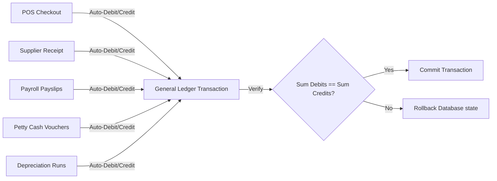

# Implementation Plan: Local Enterprise Resource Planning (ERP) Suite

This document outlines the architecture, database design, security protocols, and phased implementation tasks for a local-first, offline-capable Enterprise Resource Planning (ERP) system.

## Goal Description
Build a desktop-first, local-first management suite to operate a complete small-to-medium enterprise (SME) offline. It integrates Point of Sale (POS), CRM, Inventory, Supplier Procurement (PO to Goods Receipt), Worker Labor & Payroll (hourly timecards + piece-rates), Fixed Assets register (depreciation), Petty Cash Expense vouchers, and a double-entry General Ledger (G/L) bookkeeping engine.

The system runs completely **offline** on a local computer, using a local SQLite database file, requiring no internet connectivity.

### Design Aesthetic
The application employs a minimal, clean, Apple-inspired 'Bento-box' visual language with high-contrast neutral backgrounds, solid crisp white panels, and signature interactive blue accents. This maximizes daylight readability for cashiers and warehouse staff, prioritizing function and clarity over distracting visual elements.

---

## 1. Architectural & Concurrency Foundations

To support multi-device operations on a local area network (LAN) safely without database lock failures:

### Next.js Local Server Bindings & HTTPS Secure Contexts
- **Server Binding**: Next.js server binds to `0.0.0.0:3000` (allowing local network devices like tablets or satellite PCs to hit the server IP).
- **DNS/mDNS Resolution**: The server runs an mDNS broadcast so local clients can access it via a friendly name: `https://construction-erp.local:3000`.
- **LAN Secure Contexts (HTTPS)**: Modern web browsers restrict crypto features, clipboard copy actions, and offline Service Workers (PWA) on non-secure (HTTP) connections. To enable these over the LAN, **Phase 1** incorporates a local SSL certificate setup step using **`mkcert`** to generate a locally trusted Certificate Authority (CA) and self-signed certificates. The server is booted in HTTPS mode:
  ```bash
  next dev --experimental-https --experimental-https-key ./certificates/key.pem --experimental-https-cert ./certificates/cert.pem
  ```
- **Single DB Worker Pattern**: No client devices touch the SQLite file directly over network shares. All interactions are routed as HTTP requests to Next.js Server Actions on the host computer.
- **IP Detection & Proxy Configuration (Default-Deny)**:
  - **Default-Deny Rule**: By default, the Next.js server resolves client IP addresses using `req.socket.remoteAddress` only. All client-supplied `X-Forwarded-For` headers are strictly ignored.
  - **Trusted Proxy Switch**: Next.js will *only* parse the `X-Forwarded-For` header if the Administrator has explicitly enabled "Reverse Proxy Mode" in `system_config` and registered a specific trusted proxy CIDR range.

### SQLite Concurrency & Event Loop Management
- **WAL Concurrency Tuning**: SQLite is initialized in Write-Ahead Logging (WAL) mode with a busy timeout buffer to handle concurrent writes:
  ```typescript
  db.pragma('journal_mode = WAL');
  db.pragma('synchronous = NORMAL');
  db.pragma('busy_timeout = 10000');
  ```
- **Non-Blocking Worker Threads**: Because `better-sqlite3` is fully synchronous, executing large G/L reports (like multi-year Trial Balances or inventory audit crawls) blocks the Node.js event loop, freezing checkouts on other register terminals. To prevent this, **all heavy reports, P&Ls, and ledger crawls must be offloaded to Node.js Worker Threads (`worker_threads` module)**, keeping the main process loop free for low-latency checkout server actions.
  - **Connection Isolation**: Node database connection handles cannot cross thread boundaries. Therefore, **each Worker Thread must instantiate its own isolated, read-only better-sqlite3 connection**:
    ```typescript
    import Database from 'better-sqlite3';
    const db = new Database('data/database.db', { readonly: true });
    ```

---

## 2. Hardened Production-Grade Security & Backup Mechanics

### A. Key Decoupling: Daily Unlock vs. Disaster Mnemonic
To avoid operational deadlocks where cashiers cannot boot the registers without dual-custody physical attendance:
- **Master Ledger Encryption Key (MLEK)**: A random 256-bit key used for all column-level AES-256-GCM encryption and ledger HMAC signatures.
- **Mnemonic Passphrase (MMP)**: A 12-word BIP39 mnemonic split between two custodians (Words 1-6 Owner, Words 7-12 Accountant). **Used ONLY for disaster recovery or system re-installation.**
- **Daily Operational Passphrase (DOP)**: A secure, alphanumeric passphrase. **Used for daily routine server boots.**
  - **Entropy Enforcement**: The DOP must satisfy:
    - Minimum length of **14 characters**.
    - Complexity containing at least three of: lowercase letters, uppercase letters, numeric digits, and special symbols. (Optionally, a 4-word diceware passphrase).
    - Checks run on the server side at setup/rotation; low-entropy inputs are rejected.
  - **Access Boundary**: Knowledge of the DOP is strictly restricted to **Managers and Administrators**. Cashiers do not have this passphrase.
  - **Store Boot Workflow**: On daily shop opening, a Manager or Admin must log in first to enter the DOP and decrypt the MLEK into the server's process memory (`global.mlekSecret`). Cashiers cannot run transactions until the database engine is unlocked for the day.
  - **DOP Rotation Flow**: Changing the DOP is an Admin-only action. The Admin enters the old DOP (decrypting the MLEK), inputs a new DOP (validating entropy rules), and the server generates a new PBKDF2-SHA512 key (100,000 iterations) to re-encrypt the MLEK and save it to `mlek_encrypted_dop`.
- **Storage Rules**: The `system_config` table stores two copies of the MLEK:
  1. `mlek_encrypted_dop`: MLEK encrypted with a key derived from the DOP using **PBKDF2-SHA512 with 100,000 iterations**.
  2. `mlek_encrypted_mmp`: MLEK encrypted with a key derived from the 12-word MMP using **PBKDF2-SHA512 with 600,000 iterations**.
- **Volatile Execution**: Decrypting either DOP or MMP loads the MLEK into `global.mlekSecret`.

$$\text{Entry } N \text{ Hash} = \text{HMAC-SHA256}(\text{data} + \text{Entry } N-1 \text{ Hash}, \text{global.mlekSecret})$$

### B. Login & Store Unlock Rate Limiting & Lockout Engine
To prevent online brute-forcing of cashier PINs, the Daily Passphrase (DOP), and the Master Mnemonic Passphrase (MMP):
- **Tracking**: Every failed login attempt, failed store unlock attempt, and failed disaster recovery attempt is logged in a local `login_attempts` table, capturing attempt type, target target_id/username, timestamp, and client IP.
- **Attempt Types**: Logged via an explicit check constraint: `attempt_type IN ('PIN', 'DOP', 'MMP')`.
- **Throttling Windows**:
  - **Single IP Lockout**: If a client IP address generates 3 failed attempts (of any type) within a 5-minute window, that specific IP is blocked from accessing the auth, unlock, and recovery endpoints for 5 minutes (preventing local network DoS attacks targeting registers).
  - **Account/System Lockout**: If a PIN account, the DOP unlock page, or the MMP recovery page gets 5 failures across any IP within a 15-minute window, access is locked for 15 minutes.
- **Failed Unlock Audits**:
  - Every failed DOP or MMP entry is recorded as a high-priority `STORE_UNLOCK_FAILED` or `STORE_RECOVERY_FAILED` action in the system audit log.
  - Upon next successful boot/login, the dashboard displays a persistent warning banner if failed unlock attempts occurred.

### C. Master Recovery Mnemonic Escrow (Dual-Custody Security)
- **Escrow Security Directive**: The setup screen prompts a dual-custody policy recommendation:
  - Words 1-6 with the Owner in a private safe.
  - Words 7-12 with the company Accountant or at a separate off-site location.

### D. Automated Disaster Recovery Backup Engine
- **WAL Checkpointing**: The daily backup cron job (11:00 PM) executes:
  ```typescript
  await db.backup('data/backups/temp_backup.db');
  ```
- **Conditional Encryption Flow**:
  - **Unlocked State (MLEK in Memory)**: The backup engine reads `temp_backup.db`, encrypts it under **AES-256-GCM** using the MLEK, and saves it. Logs a `BACKUP_COMPLETED` audit event.
  - **Locked State (MLEK absent)**: The engine copies the raw `temp_backup.db` directly to the backup folder. It logs a `BACKUP_COMPLETED_LOCKED_STATE` audit event and registers a warning.
  - **Backup Exposure Caveat**: 
    > [!WARNING]
    > **Locked-State Backup Visibility**: While customer PII (phone numbers, addresses) remains encrypted at rest inside the database during locked states, general business metrics are stored in plaintext. The backup target path (USB/NAS) must utilize OS-level file encryption (e.g. BitLocker, LUKS) or strict filesystem access permissions.

### E. Audit Log Sanitization Rule (PII Leak Prevention)
To prevent decrypted plaintext or ephemeral GCM ciphertexts (whose initialization vectors rotate constantly) from leaking into transaction logs:
- **Masking Rule**: Any system audits mapping edits to GCM-encrypted columns (e.g. customer/supplier phone numbers, email addresses, job site contacts) must mask the values using the static label **`[ENCRYPTED DATA]`** in `old_value` and `new_value`. This logs that an update occurred without leaking plain text or exposing differing ciphertext blocks.

---

## 3. Core Business & Bookkeeping Lifecycles

### A. Chart of Accounts & Balanced General Ledger (G/L)
No manual overrides. Every transaction runs through `db.transaction()` and registers a balanced G/L ledger journal entry:



### B. Concurrency-Safe Invoice & Document Numbering (Philippine Tax Compliance)
To conform with standard tax regulations, the system splits transaction documents into Sales Invoices and Official Receipts:
- **Sales Invoice (SI)**: Generated for the sale of physical inventory goods (cement, blocks, aggregate, sand).
- **Official Receipt (OR)**: Generated for services rendered (delivery charges, freight fees, custom hollow block fabrication services).
- **Sequential Trigger**: SQLite triggers automatically calculate separate sequential serial numbers on insert:
  ```sql
  CREATE TRIGGER IF NOT EXISTS assign_document_numbers
  AFTER INSERT ON transactions
  FOR EACH ROW
  BEGIN
    -- Assign sequential Sales Invoice Number if goods exist
    UPDATE transactions
    SET sales_invoice_number = COALESCE((SELECT MAX(sales_invoice_number) FROM transactions), 10000) + 1
    WHERE id = NEW.id AND NEW.subtotal > 0;

    -- Assign sequential Official Receipt Number if delivery fee is charged
    UPDATE transactions
    SET official_receipt_number = COALESCE((SELECT MAX(official_receipt_number) FROM transactions), 50000) + 1
    WHERE id = NEW.id AND NEW.delivery_fee > 0;
  END;
  ```

### C. G/L Double-Entry Balance Verification Scanner
A daily background health checker groups all G/L `journal_lines` by transaction and asserts that the sum of Debits minus Credits is exactly `0`, raising an admin alert if a bug causes discrepancy.

### D. Role-Based Access Control (RBAC) Authorization Matrix
To protect accounting entries, inventory adjustments, and payroll metrics, the system implements three rigid roles:

| Module Feature | Cashier | Manager | Administrator |
| :--- | :---: | :---: | :---: |
| POS Checkouts & Deliveries | ✓ | ✓ | ✓ |
| Customer Ledgers & Statements | View Only | ✓ | ✓ |
| Inventory Cost Price Lists | ✗ | ✓ | ✓ |
| Void/Return Transactions | ✗ | ✓ | ✓ |
| Staff Management & Payroll | ✗ | ✓ | ✓ |
| Chart of Accounts (COA) / Manual G/L | ✗ | ✗ | ✓ |
| Database Encrypted Backups / Restores | ✗ | ✗ | ✓ |

### E. Unit Conversions & Scaled Integer Quantities (Millicounts)
To prevent decimal rounding drift during unit conversions or fractional bulk deliveries:
- **Millicounts Quantity Precision**: **All product stock levels, cart quantities, PO lines, and dispatch units are stored as INTEGERS representing millicounts** ($1.0$ base unit is stored as `1000`, $4.34$ cu.m of Sand is stored as `4340`).
- **Multiplier Schema**: The `unit_conversions` table maps alternative units to base units using millicount multipliers:
  - Sand: Alternative `6-wheel load` = Base `4.0 cu.m` (Multiplier stored as integer: `4000`).
  - Cement: Alternative `pallet` = Base `40.0 bag` (Multiplier stored as integer: `40000`).
- **POS Calculations**: Cart deductions calculate `CartQty (millicounts) * Multiplier (millicounts) / 1000` and deduct the converted integer total from the base inventory stock.

### F. Monetary Fixed-Point Integer Precision (Avoiding Decimal Drift)
- **Constraint**: All currency values, costs, taxes, and wages are stored as **INTEGERS representing centavos** (e.g. `$10.50` is stored as `1050`).
- **Historical Margin Freeze (Profitability Audit Protection)**: Because `inventory.cost_price` fluctuates dynamically using a Weighted Average Cost as new supplier POs arrive, calculating historical gross margin off current costs will falsify past reports. To resolve this, **`transaction_items` retains a `unit_cost` column (INTEGER centavos). At checkout, the system snapshots the item's current cost_price into this column, freezing margins.**
- **Plaintext Ledger & HMAC Integrity**: To support double-entry summing and G/L validation queries, `customer_ledger.amount` and G/L financial lines are stored in **plaintext centavo integers** rather than ciphertext. Confidentiality is maintained via column-level GCM encryption on customer PII fields, while ledger integrity is guaranteed by the HMAC signature chain.
- **Rounding Rules**: VAT (+12%) is computed only on the grand total using:
$$\text{VAT Amount} = \text{round}(\text{Vatable Subtotal} \times 12) / 100$$
(Integer math operations division happens only at rendering boundaries).

### G. Post-Dated Check (PDC) Bounce Logic Integration (Double-Write Sync)
When a check bounces, the customer's ledger balance and the G/L adjust in lockstep inside a single database transaction:
- **Customer Ledger Reversal**: Inserts a new `DEBIT` entry into `customer_ledger` referencing the bounced check ID with description "Bounced Check Reversal". Recomputes the next **HMAC-SHA256 signature** in the chain.
- **Customer Balance Update**: Increases `current_balance = current_balance + amount` in the `customers` table.
- **G/L Entry**:
  - Debit: `1110 - Accounts Receivable` (Customer asset increases back)
  - Credit: `1010 - Cash Drawer` (or Check Clearing Account decreases)

### H. Shift Close Z-Reading (EOD Compliance Report)
To ensure correct tax tracking, the cashier shift drawer reconciliation (Phase 14) generates a formal **Z-Reading Report** upon shift closure:
- **Report Ledger**: Computes total gross sales (separated into Vatable Sales, VAT-Exempt Sales, Zero-Rated Sales), total collected VAT tax (12%), total voided invoices, total sales returns, and cash discrepancies.
- **Tally Verification Boundaries**: Only checkouts with `payment_method = 'Cash'` increment the `shifts.expected_cash` totals. Transactions processed under ledger credit accounts or checks (PDCs) bypass the physical cash drawer expected count.
- **Output**: Generates a structured PDF/A5 compliant printout, saves a static snapshot in the database, and locks the shift history from future modification.

### I. Soft-Deletes for Relational Integrity
To preserve complete financial records and avoid breaking cascading foreign key references:
- **Rule**: Hard database deletes are prohibited on key business tables. Instead, **`customers`**, **`suppliers`**, and **`inventory`** records include an `is_active` soft-delete flag:
  ```sql
  is_active INTEGER DEFAULT 1 CHECK(is_active IN (0, 1))
  ```
- **UI Queries**: Client views query records `WHERE is_active = 1` for selection, while ledger history joins can retrieve deactivated items normally.

---

## 4. Database Schema Blueprint (24 Tables)

### SQL Schemas (`src/lib/db.ts`)
```sql
-- 1. Schema Version Migration Tracker
CREATE TABLE IF NOT EXISTS schema_migrations (
  version INTEGER PRIMARY KEY,
  applied_at TEXT NOT NULL
);

-- 2. General Ledger Chart of Accounts (Monetary columns as INTEGER centavos)
CREATE TABLE IF NOT EXISTS accounts (
  id TEXT PRIMARY KEY,
  code TEXT NOT NULL UNIQUE,
  name TEXT NOT NULL,
  category TEXT CHECK(category IN ('Asset', 'Liability', 'Equity', 'Revenue', 'Expense')) NOT NULL,
  balance INTEGER DEFAULT 0 -- Stored in centavos
);

CREATE TABLE IF NOT EXISTS journal_entries (
  id TEXT PRIMARY KEY,
  date TEXT NOT NULL,
  description TEXT NOT NULL,
  created_by TEXT,
  FOREIGN KEY (created_by) REFERENCES users(id)
);

CREATE TABLE IF NOT EXISTS journal_lines (
  id TEXT PRIMARY KEY,
  journal_entry_id TEXT NOT NULL,
  account_id TEXT NOT NULL,
  type TEXT CHECK(type IN ('DEBIT', 'CREDIT')) NOT NULL,
  amount INTEGER NOT NULL CHECK(amount > 0), -- Stored in centavos
  FOREIGN KEY (journal_entry_id) REFERENCES journal_entries(id) ON DELETE CASCADE,
  FOREIGN KEY (account_id) REFERENCES accounts(id)
);

-- 3. Staff & Authentication (SYSTEM daemon is seeded)
CREATE TABLE IF NOT EXISTS users (
  id TEXT PRIMARY KEY,
  username TEXT NOT NULL UNIQUE,
  name TEXT NOT NULL,
  role TEXT CHECK(role IN ('Cashier', 'Manager', 'Admin')) NOT NULL,
  passcode_hash TEXT NOT NULL,
  passcode_salt TEXT NOT NULL,
  is_active INTEGER DEFAULT 1 CHECK(is_active IN (0, 1)),
  is_system INTEGER DEFAULT 0 CHECK(is_system IN (0, 1))
);

CREATE TABLE IF NOT EXISTS login_attempts (
  id TEXT PRIMARY KEY,
  attempt_type TEXT CHECK(attempt_type IN ('PIN', 'DOP', 'MMP')) NOT NULL,
  username TEXT NOT NULL, -- Holds username, or target identifier
  ip_address TEXT NOT NULL,
  timestamp INTEGER NOT NULL,
  is_successful INTEGER NOT NULL
);

-- 4. Customer Accounts & Job Sites (Soft-deletable)
CREATE TABLE IF NOT EXISTS customers (
  id TEXT PRIMARY KEY,
  name TEXT NOT NULL,
  phone TEXT, -- Encrypted AES-256-GCM
  address TEXT, -- Encrypted AES-256-GCM
  credit_limit INTEGER DEFAULT 0 CHECK(credit_limit >= 0), -- Stored in centavos
  current_balance INTEGER DEFAULT 0, -- Stored in centavos
  price_tier TEXT CHECK(price_tier IN ('Retail', 'Wholesale')) DEFAULT 'Retail',
  is_vat_exempt INTEGER DEFAULT 0 CHECK(is_vat_exempt IN (0, 1)),
  is_active INTEGER DEFAULT 1 CHECK(is_active IN (0, 1)),
  created_at TEXT NOT NULL
);

CREATE TABLE IF NOT EXISTS job_sites (
  id TEXT PRIMARY KEY,
  customer_id TEXT NOT NULL,
  name TEXT NOT NULL,
  address TEXT NOT NULL,
  contact_person TEXT,
  phone TEXT,
  FOREIGN KEY (customer_id) REFERENCES customers(id) ON DELETE CASCADE
);

-- 5. Customer Credit Ledger & PDCs (Amounts stored as plain INTEGER centavos, validated via HMAC)
CREATE TABLE IF NOT EXISTS customer_ledger (
  id TEXT PRIMARY KEY,
  customer_id TEXT NOT NULL,
  date TEXT NOT NULL,
  type TEXT CHECK(type IN ('DEBIT', 'CREDIT')) NOT NULL,
  amount INTEGER NOT NULL CHECK(amount > 0), -- Plaintext Centavos
  reference_id TEXT,
  description TEXT NOT NULL, -- Plaintext description
  hmac_signature TEXT,
  FOREIGN KEY (customer_id) REFERENCES customers(id) ON DELETE CASCADE
);

CREATE TABLE IF NOT EXISTS checks (
  id TEXT PRIMARY KEY,
  ledger_entry_id TEXT NOT NULL,
  check_number TEXT NOT NULL,
  bank_name TEXT NOT NULL,
  check_date TEXT NOT NULL,
  status TEXT CHECK(status IN ('Pending', 'Cleared', 'Bounced')) DEFAULT 'Pending',
  FOREIGN KEY (ledger_entry_id) REFERENCES customer_ledger(id) ON DELETE CASCADE
);

-- 6. Inventory & Converted Units (Quantities stored as INTEGER millicounts, Soft-deletable)
CREATE TABLE IF NOT EXISTS inventory (
  id TEXT PRIMARY KEY,
  name TEXT NOT NULL,
  category TEXT NOT NULL,
  unit TEXT NOT NULL, -- Base Unit (e.g. cu.m, pc, bag)
  stock_quantity INTEGER DEFAULT 0 CHECK(stock_quantity >= 0), -- Stored in millicounts
  cost_price INTEGER NOT NULL CHECK(cost_price >= 0), -- Centavos
  selling_price INTEGER NOT NULL CHECK(selling_price >= 0), -- Centavos
  wholesale_price INTEGER NOT NULL CHECK(wholesale_price >= 0), -- Centavos
  reorder_level INTEGER DEFAULT 0 CHECK(reorder_level >= 0), -- Stored in millicounts
  is_active INTEGER DEFAULT 1 CHECK(is_active IN (0, 1))
);

CREATE TABLE IF NOT EXISTS unit_conversions (
  id TEXT PRIMARY KEY,
  item_id TEXT NOT NULL,
  from_unit TEXT NOT NULL,
  to_unit TEXT NOT NULL,
  multiplier INTEGER NOT NULL CHECK(multiplier > 0), -- Stored as millicount scaling (e.g. 4000 = 4.0x)
  FOREIGN KEY (item_id) REFERENCES inventory(id) ON DELETE CASCADE
);

-- 7. Suppliers & Accounts Payable (Soft-deletable)
CREATE TABLE IF NOT EXISTS suppliers (
  id TEXT PRIMARY KEY,
  name TEXT NOT NULL,
  contact_person TEXT,
  phone TEXT, -- Encrypted
  email TEXT, -- Encrypted
  current_balance INTEGER DEFAULT 0, -- Centavos
  is_active INTEGER DEFAULT 1 CHECK(is_active IN (0, 1))
);

CREATE TABLE IF NOT EXISTS supplier_ledger (
  id TEXT PRIMARY KEY,
  supplier_id TEXT NOT NULL,
  date TEXT NOT NULL,
  type TEXT CHECK(type IN ('CHARGE', 'PAYMENT')) NOT NULL,
  amount INTEGER NOT NULL CHECK(amount > 0), -- Centavos
  reference_id TEXT,
  description TEXT,
  FOREIGN KEY (supplier_id) REFERENCES suppliers(id) ON DELETE CASCADE
);

-- 8. Sales Quotes & Orders
CREATE TABLE IF NOT EXISTS quotations (
  id TEXT PRIMARY KEY,
  customer_id TEXT NOT NULL,
  date TEXT NOT NULL,
  total_amount INTEGER NOT NULL, -- Centavos
  status TEXT CHECK(status IN ('Draft', 'Sent', 'Accepted', 'Expired')) DEFAULT 'Draft',
  FOREIGN KEY (customer_id) REFERENCES customers(id)
);

CREATE TABLE IF NOT EXISTS sales_orders (
  id TEXT PRIMARY KEY,
  customer_id TEXT NOT NULL,
  quotation_id TEXT,
  date TEXT NOT NULL,
  total_amount INTEGER NOT NULL, -- Centavos
  status TEXT CHECK(status IN ('Pending', 'Processing', 'Invoiced', 'Cancelled')) DEFAULT 'Pending',
  FOREIGN KEY (customer_id) REFERENCES customers(id),
  FOREIGN KEY (quotation_id) REFERENCES quotations(id)
);

-- 9. POS Transactions
CREATE TABLE IF NOT EXISTS transactions (
  id TEXT PRIMARY KEY,
  sales_invoice_number INTEGER UNIQUE, -- Sequential goods receipt number
  official_receipt_number INTEGER UNIQUE, -- Sequential services receipt number
  customer_id TEXT,
  cashier_id TEXT NOT NULL,
  date TEXT NOT NULL,
  subtotal INTEGER NOT NULL, -- Centavos
  tax INTEGER DEFAULT 0, -- Centavos
  delivery_fee INTEGER DEFAULT 0, -- Centavos
  discount INTEGER DEFAULT 0, -- Centavos
  total_amount INTEGER NOT NULL, -- Centavos
  amount_paid INTEGER DEFAULT 0, -- Centavos
  balance_due INTEGER DEFAULT 0, -- Centavos
  payment_status TEXT NOT NULL,
  payment_method TEXT NOT NULL,
  delivery_status TEXT NOT NULL,
  FOREIGN KEY (customer_id) REFERENCES customers(id) ON DELETE SET NULL,
  FOREIGN KEY (cashier_id) REFERENCES users(id)
);

CREATE TABLE IF NOT EXISTS transaction_items (
  id TEXT PRIMARY KEY,
  transaction_id TEXT NOT NULL,
  item_id TEXT NOT NULL,
  quantity INTEGER NOT NULL CHECK(quantity > 0), -- Millicounts
  unit_used TEXT NOT NULL,
  unit_price INTEGER NOT NULL, -- Centavos (selling price)
  unit_cost INTEGER NOT NULL CHECK(unit_cost >= 0), -- Centavos (snapshotted inventory cost_price)
  total_price INTEGER NOT NULL, -- Centavos
  FOREIGN KEY (transaction_id) REFERENCES transactions(id) ON DELETE CASCADE,
  FOREIGN KEY (item_id) REFERENCES inventory(id)
);

-- 10. Supplier Purchases
CREATE TABLE IF NOT EXISTS purchase_orders (
  id TEXT PRIMARY KEY,
  supplier_id TEXT NOT NULL,
  date TEXT NOT NULL,
  total_cost INTEGER NOT NULL, -- Centavos
  payment_method TEXT CHECK(payment_method IN ('Cash', 'Credit')) NOT NULL,
  status TEXT CHECK(status IN ('Draft', 'Sent', 'Received', 'Cancelled')) DEFAULT 'Draft',
  FOREIGN KEY (supplier_id) REFERENCES suppliers(id) ON DELETE CASCADE
);

CREATE TABLE IF NOT EXISTS purchase_order_items (
  id TEXT PRIMARY KEY,
  purchase_order_id TEXT NOT NULL,
  item_id TEXT NOT NULL,
  quantity INTEGER NOT NULL CHECK(quantity > 0), -- Millicounts
  unit_price INTEGER NOT NULL, -- Centavos
  total_cost INTEGER NOT NULL, -- Centavos
  FOREIGN KEY (purchase_order_id) REFERENCES purchase_orders(id) ON DELETE CASCADE,
  FOREIGN KEY (item_id) REFERENCES inventory(id)
);

CREATE TABLE IF NOT EXISTS goods_receipts (
  id TEXT PRIMARY KEY,
  purchase_order_id TEXT NOT NULL,
  date TEXT NOT NULL,
  received_by TEXT NOT NULL,
  FOREIGN KEY (purchase_order_id) REFERENCES purchase_orders(id),
  FOREIGN KEY (received_by) REFERENCES users(id)
);

-- 11. Logistics & Dispatches
CREATE TABLE IF NOT EXISTS deliveries (
  id TEXT PRIMARY KEY,
  transaction_id TEXT NOT NULL,
  delivery_date TEXT NOT NULL,
  driver_name TEXT NOT NULL,
  truck_plate TEXT NOT NULL,
  status TEXT CHECK(status IN ('Pending', 'Dispatched', 'Delivered')) DEFAULT 'Pending',
  FOREIGN KEY (transaction_id) REFERENCES transactions(id) ON DELETE CASCADE
);

CREATE TABLE IF NOT EXISTS delivery_items (
  id TEXT PRIMARY KEY,
  delivery_id TEXT NOT NULL,
  item_id TEXT NOT NULL,
  quantity_delivered INTEGER NOT NULL CHECK(quantity_delivered > 0), -- Millicounts
  FOREIGN KEY (delivery_id) REFERENCES deliveries(id) ON DELETE CASCADE,
  FOREIGN KEY (item_id) REFERENCES inventory(id)
);

-- 12. Labor, Shifts, & Payroll
CREATE TABLE IF NOT EXISTS shifts (
  id TEXT PRIMARY KEY,
  cashier_id TEXT NOT NULL,
  start_time TEXT NOT NULL,
  end_time TEXT,
  opening_float INTEGER NOT NULL, -- Centavos
  expected_cash INTEGER, -- Centavos
  actual_cash INTEGER, -- Centavos
  discrepancy INTEGER, -- Centavos
  status TEXT CHECK(shift_status IN ('Open', 'Closed')) DEFAULT 'Open',
  FOREIGN KEY (cashier_id) REFERENCES users(id)
);

CREATE TABLE IF NOT EXISTS shift_z_readings (
  id TEXT PRIMARY KEY,
  shift_id TEXT NOT NULL UNIQUE,
  date TEXT NOT NULL,
  gross_sales INTEGER NOT NULL, -- Centavos
  vat_collected INTEGER NOT NULL, -- Centavos
  vatable_sales INTEGER NOT NULL, -- Centavos
  exempt_sales INTEGER NOT NULL, -- Centavos
  total_voids INTEGER NOT NULL, -- Centavos
  total_returns INTEGER NOT NULL, -- Centavos
  total_collections INTEGER NOT NULL, -- Centavos
  FOREIGN KEY (shift_id) REFERENCES shifts(id)
);

CREATE TABLE IF NOT EXISTS workers (
  id TEXT PRIMARY KEY,
  name TEXT NOT NULL,
  role TEXT CHECK(role IN ('Helper', 'Driver', 'Block Maker')) NOT NULL,
  phone TEXT,
  pay_rate INTEGER DEFAULT 0 CHECK(pay_rate >= 0), -- Centavos
  is_active INTEGER DEFAULT 1 CHECK(is_active IN (0, 1))
);

CREATE TABLE IF NOT EXISTS timecards (
  id TEXT PRIMARY KEY,
  worker_id TEXT NOT NULL,
  date TEXT NOT NULL,
  hours_worked REAL NOT NULL CHECK(hours_worked >= 0),
  FOREIGN KEY (worker_id) REFERENCES workers(id) ON DELETE CASCADE
);

CREATE TABLE IF NOT EXISTS production_logs (
  id TEXT PRIMARY KEY,
  worker_id TEXT NOT NULL,
  date TEXT NOT NULL,
  item_id TEXT NOT NULL,
  quantity INTEGER NOT NULL CHECK(quantity > 0), -- Millicounts
  earnings INTEGER NOT NULL, -- Centavos
  FOREIGN KEY (worker_id) REFERENCES workers(id) ON DELETE CASCADE,
  FOREIGN KEY (item_id) REFERENCES inventory(id)
);

CREATE TABLE IF NOT EXISTS payslips (
  id TEXT PRIMARY KEY,
  worker_id TEXT NOT NULL,
  date_disbursed TEXT NOT NULL,
  period_start TEXT NOT NULL,
  period_end TEXT NOT NULL,
  hourly_earnings INTEGER NOT NULL, -- Centavos
  piece_earnings INTEGER NOT NULL, -- Centavos
  total_earnings INTEGER NOT NULL, -- Centavos
  FOREIGN KEY (worker_id) REFERENCES workers(id)
);

CREATE TABLE IF NOT EXISTS delivery_helpers (
  id TEXT PRIMARY KEY,
  delivery_id TEXT NOT NULL,
  worker_id TEXT NOT NULL,
  FOREIGN KEY (delivery_id) REFERENCES deliveries(id) ON DELETE CASCADE,
  FOREIGN KEY (worker_id) REFERENCES workers(id) ON DELETE CASCADE
);

-- 13. Assets & General Expenses
CREATE TABLE IF NOT EXISTS fixed_assets (
  id TEXT PRIMARY KEY,
  name TEXT NOT NULL,
  purchase_date TEXT NOT NULL,
  purchase_cost INTEGER NOT NULL CHECK(purchase_cost > 0), -- Centavos
  salvage_value INTEGER DEFAULT 0 CHECK(salvage_value >= 0), -- Centavos
  useful_life_years INTEGER NOT NULL CHECK(useful_life_years > 0),
  accumulated_depreciation INTEGER DEFAULT 0 -- Centavos
);

CREATE TABLE IF NOT EXISTS cash_vouchers (
  id TEXT PRIMARY KEY,
  date TEXT NOT NULL,
  pay_to TEXT NOT NULL,
  amount INTEGER NOT NULL CHECK(amount > 0), -- Centavos
  category TEXT CHECK(category IN ('Utilities', 'Rent', 'Office Supplies', 'Maintenance', 'Other')) NOT NULL,
  notes TEXT
);

CREATE TABLE IF NOT EXISTS fleet_expenses (
  id TEXT PRIMARY KEY,
  truck_plate TEXT NOT NULL,
  date TEXT NOT NULL,
  expense_type TEXT CHECK(expense_type IN ('Fuel', 'Maintenance', 'Toll', 'Other')) NOT NULL,
  amount INTEGER NOT NULL CHECK(amount > 0), -- Centavos
  notes TEXT
);

-- 14. System Configuration Store
CREATE TABLE IF NOT EXISTS system_config (
  key TEXT PRIMARY KEY,
  value TEXT NOT NULL
);

-- 15. Non-Ledger Security Auditing
CREATE TABLE IF NOT EXISTS system_audit_logs (
  id TEXT PRIMARY KEY,
  timestamp TEXT NOT NULL,
  user_id TEXT, -- Can be NULL for background system events (SYSTEM daemon)
  action_type TEXT NOT NULL,
  reference_id TEXT,
  old_value TEXT,
  new_value TEXT,
  FOREIGN KEY (user_id) REFERENCES users(id)
);
```

### Seeding Required Core Rows (`src/lib/db.ts`)
```sql
-- Seed system daemon user for cron operations (flagged is_system = 1 to filter out from UIs)
INSERT OR IGNORE INTO users (id, username, name, role, passcode_hash, passcode_salt, is_active, is_system)
VALUES (
  'system-daemon', 
  'SYSTEM', 
  'SYSTEM Daemon', 
  'Admin', 
  '0000000000000000000000000000000000000000000000000000000000000000', 
  '0000000000000000', 
  1,
  1
);
```

---

## 5. Hybrid Migrations Engine (SQL & JS Runners)

To support complex database structural revisions that modify, decrypt, or re-encrypt encrypted fields (PII columns) which raw SQL cannot do:
- **Migration Format**: Migrations folder supports both `.sql` and `.js` / `.ts` scripts.
- **JS Migration Pattern**: A JavaScript migration exports an async function receiving the SQLite client and the volatile `global.mlekSecret`:
  ```javascript
  // Example migrations/002_split_address.js
  module.exports = async function(db, mlekSecret) {
    if (!mlekSecret) throw new Error("Database locked. Decryption key needed to migrate encrypted fields.");
    
    const customers = db.prepare("SELECT id, address FROM customers").all();
    const update = db.prepare("UPDATE customers SET street = ?, city = ? WHERE id = ?");
    
    for (const c of customers) {
      const rawAddress = decrypt(c.address, mlekSecret);
      const [street, city] = rawAddress.split(', ');
      update.run(encrypt(street, mlekSecret), encrypt(city, mlekSecret), c.id);
    }
  };
  ```

---

## 6. Detailed E2E Integration Test Suite (`scratch/verify-all-modules.js`)

To ensure database consistency, the E2E verification script checks these constraints:

```javascript
const Database = require('better-sqlite3');
const path = require('path');
const fs = require('fs');
const crypto = require('crypto');

const dbPath = path.join(__dirname, '../data/test_database.db');
if (fs.existsSync(dbPath)) fs.unlinkSync(dbPath);

const db = new Database(dbPath);
db.pragma('foreign_keys = ON');

function runTest(name, fn) {
  try {
    fn();
    console.log(`✓ PASS: ${name}`);
  } catch (e) {
    console.error(`✗ FAIL: ${name}`);
    console.error(e);
    process.exit(1);
  }
}

// Scaffold Tables
db.exec(`
  CREATE TABLE accounts (
    id TEXT PRIMARY KEY,
    code TEXT NOT NULL UNIQUE,
    category TEXT NOT NULL,
    balance INTEGER DEFAULT 0
  );

  CREATE TABLE customers (
    id TEXT PRIMARY KEY,
    name TEXT NOT NULL,
    current_balance INTEGER DEFAULT 0
  );
  
  CREATE TABLE customer_ledger (
    id TEXT PRIMARY KEY,
    customer_id TEXT NOT NULL,
    date TEXT NOT NULL,
    type TEXT NOT NULL,
    amount INTEGER NOT NULL,
    hmac_signature TEXT,
    FOREIGN KEY (customer_id) REFERENCES customers(id)
  );

  CREATE TABLE login_attempts (
    id TEXT PRIMARY KEY,
    attempt_type TEXT NOT NULL,
    username TEXT NOT NULL,
    ip_address TEXT NOT NULL,
    timestamp INTEGER NOT NULL,
    is_successful INTEGER NOT NULL
  );
`);

console.log("=== Running Hardened ERP Core DB Constraint Tests ===\n");

// 1. HMAC chain tamper check
const global = {
  mlekSecret: "super-secret-session-key-from-unlocked-mlek"
};

function calculateHMACSignature(entry, prevSig) {
  const data = `${entry.id}-${entry.customer_id}-${entry.amount}-${entry.type}-${prevSig}`;
  return crypto.createHmac('sha256', global.mlekSecret).update(data).digest('hex');
}

runTest("Security - HMAC ledger chain validation (Tamper Detection)", () => {
  // Insert initial record (using centavo integers: 20000 = $200.00)
  const ledgerId1 = "l1";
  const amount = 20000;
  const sig1 = calculateHMACSignature({ id: ledgerId1, customer_id: "c1", amount, type: "DEBIT" }, "GENESIS");

  db.prepare(`
    INSERT INTO customer_ledger (id, customer_id, date, type, amount, hmac_signature)
    VALUES ('l1', 'c1', 'now', 'DEBIT', ?, ?)
  `).run(amount, sig1);

  // Validate chain with key
  const ledger = db.prepare("SELECT * FROM customer_ledger ORDER BY date ASC").all();
  let prevSig = "GENESIS";
  for (const entry of ledger) {
    const checkSig = calculateHMACSignature(entry, prevSig);
    if (entry.hmac_signature !== checkSig) {
      throw new Error("Tampering detected!");
    }
    prevSig = entry.hmac_signature;
  }
});

runTest("Security Edge Case - Rejected manual edits without HMAC key", () => {
  // Simulate attacker editing SQLite file manually
  db.prepare("UPDATE customer_ledger SET amount = 1000 WHERE id = 'l1'").run();

  // Try validating chain
  const ledger = db.prepare("SELECT * FROM customer_ledger ORDER BY date ASC").all();
  let prevSig = "GENESIS";
  let tamperCaught = false;

  for (const entry of ledger) {
    const checkSig = calculateHMACSignature(entry, prevSig);
    if (entry.hmac_signature !== checkSig) {
      tamperCaught = true;
      break;
    }
    prevSig = entry.hmac_signature;
  }

  if (!tamperCaught) {
    throw new Error("Attacker successfully edited database values without throwing integrity error!");
  }
});

// 2. Lockout rate limit verification
function verifyLoginThrottling(attemptType, username, ipAddress) {
  const timeframe5Min = Date.now() - 300000;
  const timeframe15Min = Date.now() - 900000;

  // IP Throttling Check (checked against specific type and ip)
  const failedIPCount = db.prepare("SELECT COUNT(*) as count FROM login_attempts WHERE attempt_type = ? AND ip_address = ? AND is_successful = 0 AND timestamp > ?")
    .get(attemptType, ipAddress, timeframe5Min).count;

  if (failedIPCount >= 3) {
    return "IP_LOCKED_OUT";
  }

  // Account/Unlock Throttling Check (checked against specific type and target)
  const failedAccountCount = db.prepare("SELECT COUNT(*) as count FROM login_attempts WHERE attempt_type = ? AND username = ? AND is_successful = 0 AND timestamp > ?")
    .get(attemptType, username, timeframe15Min).count;

  if (failedAccountCount >= 5) {
    return "ACCOUNT_LOCKED_OUT";
  }

  return "PROCEED";
}

runTest("Security - Online login attempts rate limiter locks IP after 3 failures in 5 min", () => {
  // Log 3 failures from IP '192.168.1.50'
  const logAttempt = db.prepare("INSERT INTO login_attempts (id, attempt_type, username, ip_address, timestamp, is_successful) VALUES (?, 'PIN', 'user1', '192.168.1.50', ?, 0)");
  logAttempt.run("att-1", Date.now());
  logAttempt.run("att-2", Date.now());
  logAttempt.run("att-3", Date.now());

  const status = verifyLoginThrottling("PIN", "user1", "192.168.1.50");
  if (status !== "IP_LOCKED_OUT") throw new Error("Limiter failed to trigger IP lockout!");
});

runTest("Security - Online login attempts rate limiter locks Account after 5 failures in 15 min", () => {
  // Log 2 more failures from a different IP ('192.168.1.60') to reach 5 total failures for 'user1'
  const logAttempt = db.prepare("INSERT INTO login_attempts (id, attempt_type, username, ip_address, timestamp, is_successful) VALUES (?, 'PIN', 'user1', '192.168.1.60', ?, 0)");
  logAttempt.run("att-4", Date.now());
  logAttempt.run("att-5", Date.now());

  const status = verifyLoginThrottling("PIN", "user1", "192.168.1.50");
  if (status !== "ACCOUNT_LOCKED_OUT") throw new Error("Limiter failed to trigger account lockout!");
});

// 3. DOP Setup Entropy Check and Throttling
function validateDOPEntropy(dop) {
  if (dop.length < 14) return false;
  let hasLower = /[a-z]/.test(dop);
  let hasUpper = /[A-Z]/.test(dop);
  let hasDigit = /\d/.test(dop);
  let hasSpecial = /[^A-Za-z0-9]/.test(dop);
  let score = (hasLower ? 1 : 0) + (hasUpper ? 1 : 0) + (hasDigit ? 1 : 0) + (hasSpecial ? 1 : 0);
  return score >= 3;
}

runTest("Security - DOP Setup rejects low-entropy passphrases", () => {
  const isWeak = validateDOPEntropy("weakpass");
  const isShortButDiverse = validateDOPEntropy("wP1!"); // Too short
  const isStrong = validateDOPEntropy("CorrectPassphraseWord1!"); // Long and diverse

  if (isWeak) throw new Error("Accepted a low-entropy short passphrase");
  if (isShortButDiverse) throw new Error("Accepted a diverse but short passphrase");
  if (!isStrong) throw new Error("Rejected a valid high-entropy passphrase");
});

runTest("Security - Throttling is applied to store-unlock endpoint", () => {
  // Log 3 failures to DOP endpoint '/api/unlock-store'
  const logAttempt = db.prepare("INSERT INTO login_attempts (id, attempt_type, username, ip_address, timestamp, is_successful) VALUES (?, 'DOP', '/api/unlock-store', '192.168.1.99', ?, 0)");
  logAttempt.run("dop-att-1", Date.now());
  logAttempt.run("dop-att-2", Date.now());
  logAttempt.run("dop-att-3", Date.now());

  const status = verifyLoginThrottling("DOP", "/api/unlock-store", "192.168.1.99");
  if (status !== "IP_LOCKED_OUT") throw new Error("DOP unlock endpoint failed to trigger lockout on IP!");
});

console.log("\n>>> ALL Hardened ERP Core Tests Passed! <<<\n");
```
